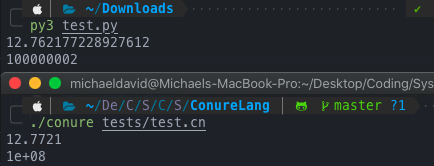

# Language Features

### Comments
These are used with the typical sequence of two forward slashes
```cs
// Single line comment
```

### Data Types
- None
- Integer
- Float
- String
- Boolean
- Function
- Class

### Built-in Keywords and Functions
```cs
let if else while for fnc class return none true false and or this super write

time() init()
```
### Printing
The keyword for printing is `write` akin to [D](https://dlang.org)'s `write()`
```cs
write "This has been printed";

// For applying syntax highlighting rules, brackets are often used
// But it is NOT a function
write("Highlighted using C#'s syntax");
```

### Naming Rules
As most languages follow, don't start with a number, use a symbol, use a keyword, or have whitespace for a variable name<br>
(Also make sure to terminate each line with a semicolon)
```cs
VALID
snakes_are_cool
soAreCamels
AndPascal
number_after_1
```

### Variables
The keyword for declaring a variable is `let`
```cs
let n = none;
let one = 1;
let floater = 2.3;
let bool = true;
bool = false; // Re-assign
```

### Arithmetic and String Operations
Basic order of operations applies and concatenation
```cs
8 / 2 * (2 + 2); // 16
"st" + "ri" + "ng"; // string
```

### Scope
Nesting is included with general curly braces and structures like if-series, loops, functions, and classes
```cs
{
  let a = "outer";
  {
    let a = "inner";
  }
}
```

### Boolean Statements and Operations
You got your `true` and `false`, as well as logical operators like `and, or, !` (`!` -> not), and comparison symbols `<, >, ==, !=, <=, >=`.
An if-series uses the keyword `if` for the start, else-ifs are a conjunction of the keywords `else` and `if`, and elses stay under the single keyword `else`
```cs
write(!(5 - 4 > 3 * 2 == !none)); // true

let a = 1;
if (a <= 2) {
  write("yes"); // This branch gets called -> yes
} else if (a == 4) {
  write("maybe");
} else {
  write("no");
}
```

### Control Flow
Loops present are `while` and `for` loops (following in the form of JS and C-type-langs)
```cs
for (let i = 1; i <= 10; i = i + 1) {
  write(i); // Numbers from 1 to 10
}

while (b <= 10) {
  write(b); // Numbers from 1 to 10
  b = b + 1;
}
```
### Functions
They are declared with the keyword `fnc`and can return any data type (or `none`)<br/>
Recursive procedures are also supported as seen below
```cs
fnc fib(n) {
  if (n < 2) return n;
  return fib(n - 2) + fib(n - 1);
}

fib(10); // 55
```
Closures also support nesting and global/local differences
```cs
let globalOne;
let globalTwo;

fnc main() {
  for (let a = 1; a <= 2; a = a + 1) {
    fnc closure() {
      write(a);
    }
    if (globalOne == none) {
      globalOne = closure;
    } else {
      globalTwo = closure;
    }
  }
}

main();
globalOne(); // 3
globalTwo(); // 3
```

### Classes and OOP
Conure is object-oriented and as such has support for classes. They are declared with the `class` keyword, can have multiple attributes, and be instantiated like below
```cs
class Pair {}

// On-the-go attribute updates
let pair = Pair();
pair.first = 1;
pair.second = 2;
write(pair.first + pair.second); // 3
```

Methods and initializers are also supported and are similar to JS with no function keyword prefix, `this` for self-reference, and the constructor this time being `init()`
```cs
class CoffeeMaker {
  init(coffee) {
    this.coffee = coffee;
  }

  brew() {
    write("Enjoy your cup of " + this.coffee);

    this.coffee = none;
  }
}

let maker = CoffeeMaker("coffee and chicory");
maker.brew(); // Enjoy your cup of coffee and chicory
```
Superclasses and inheritance are also supported through the less-than operator(`<`), like an arrow pointing to the new class as seen in Ruby
```cs
class Donut {
  cook() {
    write("Fry until golden brown");
    write("");
    write("Place in a nice box");
  }
}

class BostonCream < Donut {
  cook() {
    write("Pipe full of custard and coat with chocolate");
  }
}

BostonCream().cook(); // Pipe full of custard and coat with chocolate
```

### Performance
Performance is comparable to Python, although it can definitely be improved to exactly meet, and possibly surpass it

Here is a large class iteration below
```cs
class Zoo {
  init() {
    this.aardvark = 1;
    this.baboon   = 1;
    this.cat      = 1;
    this.donkey   = 1;
    this.elephant = 1;
    this.fox      = 1;
  }
  ant()    { return this.aardvark; }
  banana() { return this.baboon; }
  tuna()   { return this.cat; }
  hay()    { return this.donkey; }
  grass()  { return this.elephant; }
  mouse()  { return this.fox; }
}

let zoo = Zoo();
let sum = 0;
let start = time();
while (sum < 100000000) {
  sum = sum + zoo.ant() + zoo.banana() 
  + zoo.tuna() + zoo.hay() 
  + zoo.grass() + zoo.mouse();
}

write(time() - start);
write(sum);
```

And the same thing in Python
```py
from time import time

class Zoo:
  def __init__(self):
    self.aardvark = 1
    self.baboon = 1
    self.cat = 1
    self.donkey = 1
    self.elephant = 1
    self.fox = 1

  def ant(self):
    return self.aardvark
  def banana(self):
    return self.baboon
  def tuna(self):
    return self.cat
  def hay(self):
    return self.donkey
  def grass(self):
    return self.elephant
  def mouse(self):
    return self.fox

zoo = Zoo();
sum = 0;
start = time.time()
while sum < 100000000:
  sum = sum + zoo.ant() + zoo.banana() 
  + zoo.tuna() + zoo.hay() 
  + zoo.grass() + zoo.mouse();

print(time() - start)
print(sum);
```

And the speed is incredibly close (first number is the execution time in seconds)


### Planned Implementations
Features planned to be implemented in the future (in no specific order or time frame) are:
- Multi-line comments and docstrings
- Lists, arrays, and other such iterables
- Loop statements like `break` and `continue`
- Incremental shorthands (`+=, -=, *=, /=`) as well as escape characters (`\n, \t, \r`)
- User input
- Type casting
- More built-in functions
- More built-in math operations (such as floor/ceil and powers (`**`))
- File and module imports
- Built-in modules like one for math, iteration tools, etc
- Interactive REPL history
- Optional compiler (like how [Lua](https://www.lua.org) has `luac`)
- Syntax highlighting plugin for [VSCode](https://code.visualstudio.com) and/or [Sublime Text](https://www.sublimetext.com)
